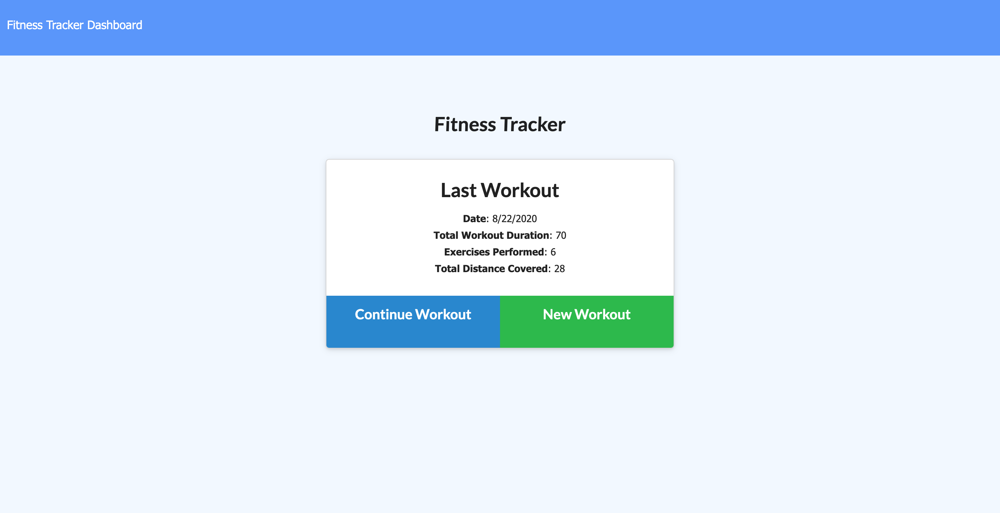
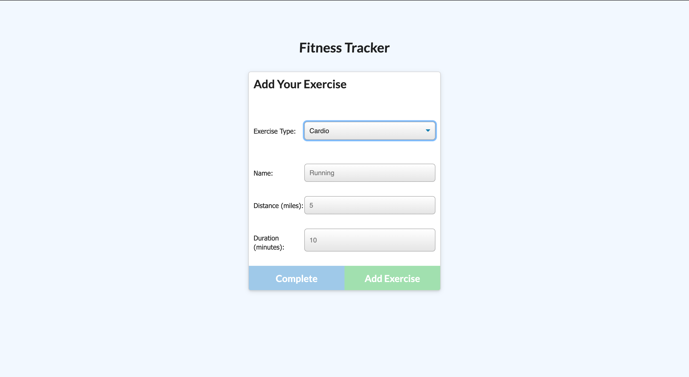
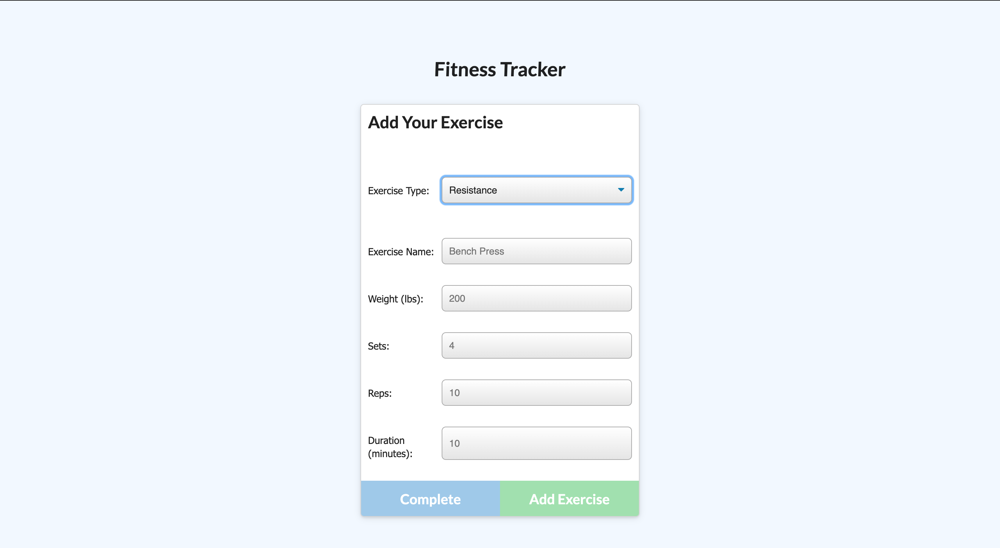
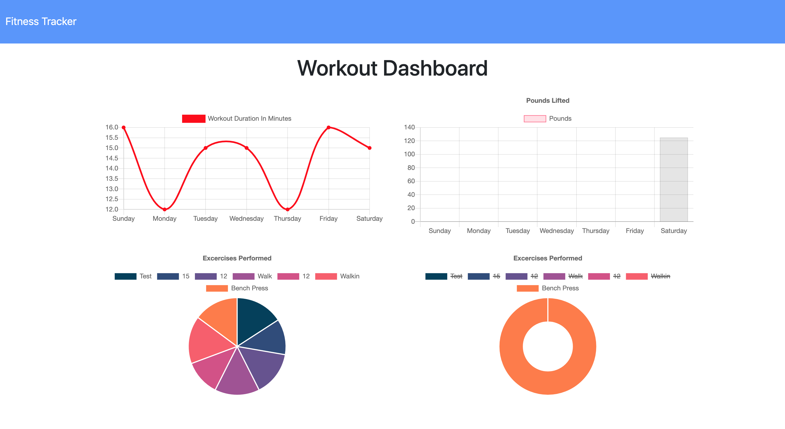

# Workout Tracker

Workout Tracker is a full-stack application that allows users to track and view all of their workouts. The user may add to or view their latest workout, or start a new workout where they can enter information about the exercises they completed. Through the dashboard, the user can view graphical representations of their workouts on a day to day basis. 

Building this application thought the pros and cons of using a noNQL database. Although they have a tone of flexibility, noSQL databases are more difficult to debug due to the fact that they rarely throw errors if something is the request to the db is off. I spent a decent amount of time debugging my put request to add an exercise to the workout exercises array because I had a minor typo. Typically that would be something really easy to pinpoint, but because the db wasn't throwing any errors, I had to console debug. 

## Table of Contents
* [Technologies](#technologies)
* [Usage](#usage)
* [Finished Product](#finished-product)
* [Questions](#questions)

## Technologies
- [HTML](https://html.com/)
- [CSS](https://developer.mozilla.org/en-US/docs/Web/CSS)
- [JavaScript](https://www.javascript.com/)
- [Node.js](https://nodejs.org/en/)
- [Express.js](https://expressjs.com/)
- [MongoDB](https://www.mongodb.com/)
- [Mongo Atlas](https://www.mongodb.com/cloud/atlas)
- [Mongoose](https://www.npmjs.com/package/mongoose)
- [Chart.js](https://www.chartjs.org/)
- [Heroku](https://dashboard.heroku.com/apps)

## Usage
* Navigate to the [deployed Heroku App](https://ng-workout-tracker.herokuapp.com).
* Click the get started button.
* Add a note title and body in the provided text box.
* Save your note by clicking the save icon.
* View a list of your saved notes on the left hand side.
* Click on any note in the list to view your full note.
* Create a new note at any time by clicking the pencil button.
* Delete any note by pressing it's "trashcan" icon.

## Finished Product
View deployed Heroku app [here](https://ng-workout-tracker.herokuapp.com).

## Questions
​
If you have any questions about the repo, please contact me:

On GitHub: [ngoudeau2012](https://github.com/ngoudeau2012) | Via Email: ngoudeau2012@gmail.com